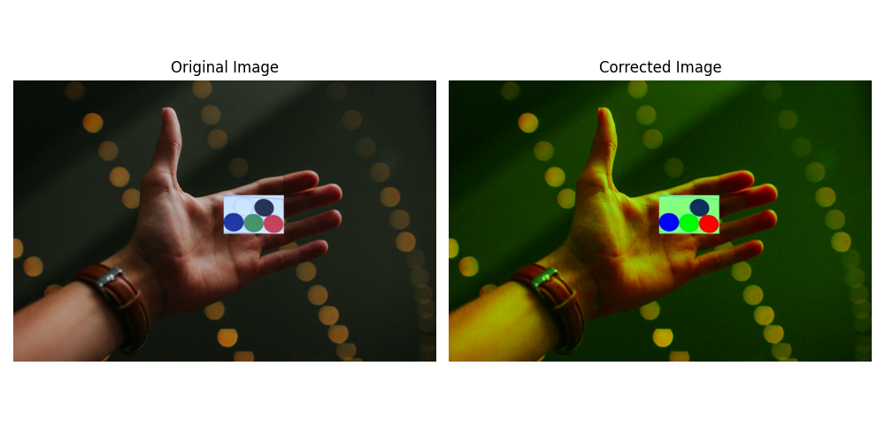

# Color Correction Project

This part of the project performs automated color correction using text to image detection pretrained model and linear algebra techniques. The OWL-ViT object detection model is used to identify color circles on a calibration card and once colors are detected, it applies a linear transformation for color adjustment. The adjuctment can be performed to trnsform red, blue and green colors from colorcard to any three preindicated colors.

## Example Visualizations
- **Detected Circles on the Color Card (to be uploaded)**
- **Original vs. Corrected Image Comparison**


## Project Structure
The `color_correction` module is organized as follows:
```
color_correction/
├── model_utils.py            # Loading the OWL-ViT model and image preprocessing, identification of potential color circles
├── color_detection.py        # Circle detection and color extraction
├── transformation.py         # Color correction using linear algebra (through construction of matrix transformation between detected colors and target ones)
├── visualization.py          # Visualization functions for debugging and plotting of results
├── __init__.py               # Import management for the module
```

## Features
- **Deep Learning Integration:** Utilizes OWL-ViT for object detection.
- **Linear Color Transformation:** Applies linear algebra for color correction.
- **Image Preprocessing:** Rotates and resizes input images.
- **Visualization:** Tools for debugging and displaying results.

## How It Works
1. **Model Loading:** The `load_model()` function loads the OWL-ViT model and processor.
2. **Color Detection:** Circles on the calibration card are detected using object detection.
3. **Color Transformation:** A transformation matrix is calculated to normalize colors.
4. **Image Correction:** The matrix is applied to adjust the image colors.

## Installation
Ensure you have Python installed. To install the required dependencies (requitements.txt is in the original Anemia_detection folder):
```bash
pip install -r requirements.txt
```

## Usage
### Running in Python Script
```python
from color_correction import load_model, image_preprocess, calculate_matrix_transform, apply_color_correction, plot_original_vs_corrected

load_model()
img_path = "path/to/image.jpg"
img = image_preprocess(img_path)
A_transform = calculate_matrix_transform(img_path)
corrected_img = apply_color_correction(img, A_transform)
plot_original_vs_corrected(img, corrected_img)
```
